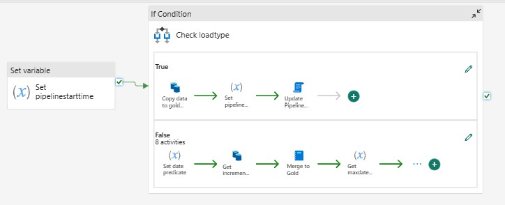
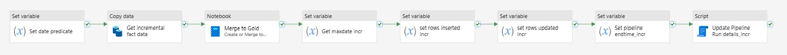

# Pattern 1: Load from Fabric Lakehouse to Fabric Gold Lakehouse
To complete this pattern, we will:
- Create the pipeline to load data from the Fabric Lakehouse to the Gold Lakehouse
- Update the Orchestrator pipeline to do the Lookup against the Metadata Database table and call the new pipeline
## Create the pipeline to load data from Fabric Lakehouse to Gold Fabric Lakehouse
When this pipeline is complete, it will look like this: 

1. Create a new Data Pipeline called **Load Lakehouse Table**
1. Add a **Set Variable** activity
1. Click on the canvas and create the following **Parameters**:
    | Name              | Type   |
    | ----------------- | ------ |
    | sourcestartdate   | String |
    | sourceenddate     | String |
    | sourceschema      | String |
    | sourcetable       | String |
    | loadtype          | String |
    | batchloaddatetime | String |
    | sinktable         | String |
    | tablekey          | String |
    | tablekey2         | String |
1. Add pipeline **Variables**:
    | Name              | Type   |
    | ----------------- | ------ |
    | datepredicate     | String |
    | maxdate           | String |
    | rowsinserted      | String |
    | rowsupdated       | String |
    | pipelinestarttime | String |
    | pipelineendtime   | String |
1. Configure the **Set variable** added in step 2:
     Tab      | Configuration | Value type         | Value                 |
    | -------- | ------------- | ------------------ | --------------------- |
    | General  | Name          | String             | Set pipelinestarttime |
    | Settings | Variable type | Radio Button       | Pipeline variable     |
    | Settings | Name          | String             | pipelinestarttime     |
    | Settings | Value         | Dynamic Content | @utcnow()             |
1. Add **If condition** activity, drag the green arrow from the previous activity to it and configure:
    | Tab        | Configuration | Value type         | Value                                          |
    | ---------- | ------------- | ------------------ | ---------------------------------------------- |
    | General    | Name          | String             | Check loadtype                                 |
    | Activities | Expression    | Dynamic Content | @equals(pipeline().parameters.loadtype,'full') |
1. Now configure the **If True** activities. Like the previous pipeline, the True activities will be a flow of activities when the table to be loaded is a full load. When completed, the True activities will look like this:

    1. Add **Copy Data** Activity and configure:
    
        | Tab         | Configuration             | Value Type         | Value                               |
        | ----------- | ------------------------- | ------------------ | ----------------------------------- |
        | General     | Name                      | String             | Copy data to gold lakehouse         |
        | Source      | Data store type           | Radio Button       | Workspace                           |
        | Source      | Workspace data store type | Drop down          | Data Warehouse                      |
        | Source      | Data Warehouse            | Drop down          | \<choose your Fabric Data Warehouse>         |
        | Source      | Use query                 | Radio Button       | Table                               |
        | Source      | Table (Schema)            | Dynamic Content | @pipeline().parameters.sourceschema |
        | Source      | Table (Table name)        | Dynamic Content | @pipeline().parameters.sourcetable  |
        | Destination | Data store type           | Radio Button       | Workspace                           |
        | Destination | Workspace data store type | Drop down          | Lakehouse                           |
        | Destination | Lakehouse                 | Drop down          | \<choose your Fabric Gold Lakehouse>         |
        | Destination | Root folder               | Radio Button       | Tables                              |
        | Destination | Table (Table name)        | Dynamic Content | @pipeline().parameters.sinktable    |
        | Destination | Advanced -> Table action  | Radio Button       | Overwrite                           |
    1. Add **Set variable** activity, drag the green arrow from the previous activity to it and configure:
        | Tab      | Configuration | Value Type         | Value                |
        | -------- | ------------- | ------------------ | -------------------- |
        | General  | Name          | String             | Set pipeline endtime |
        | Settings | Variable type | Radio Button       | Pipeline variable    |
        | Settings | Name          | Dropdown           | pipelineendtime      |
        | Settings | Value         | Dynamic Content | @utcnow()            |
    1. Add **Script** activity, drag the green arrow from the previous activity to it and configure:
        | Tab      | Configuration   | Value Type   | Value                                             |
        | -------- | --------------- | ------------ | ------------------------------------------------- |
        | General  | Name            | String       | Update Pipeline Run details                       |
        | Settings | Data store type | Radio Button | External                                          |
        | Settings | Connection      | Dropdown     | Connection to FabricMetdataOrchestration Database |
        | Settings | Script(1)       | Radio Button | NonQuery                                          |
        | Settings | Script(2)       | Dynamic Content | Update dbo.PipelineOrchestrator_FabricLakehouseGold set batchloaddatetime = '@{pipeline().parameters.batchloaddatetime}', loadstatus = '@{activity('Copy data to gold lakehouse').output.executionDetails[0].status}',  rowscopied= @{activity('Copy data to gold lakehouse').output.rowsCopied},deltalakeinserted= @{activity('Copy data to gold lakehouse').output.rowsCopied}, rowsread= @{activity('Copy data to gold lakehouse').output.rowsRead}, pipelinestarttime='@{variables('pipelinestarttime')}', pipelineendtime = '@{variables('pipelineendtime')}' where sourceschema = '@{pipeline().parameters.sourceschema}' and sourcetable = '@{pipeline().parameters.sourcetable}'  |
    1. Exit the **True activities** box of the **If condition** by clicking on  **Main canvas** in the upper left corner
1. Now configure the **If False** activities. Your False activities will be a flow of activities when the table to be loaded should be an incremental load. When completed, the False activities will look like this: 

    1. Add **Set variable** activity and configure:
        | Tab      | Configuration | Value Type   | Value              |
        | -------- | ------------- | ------------ | ------------------ |
        | General  | Name          | String       | Set date predicate |
        | Settings | Variable type | Radio Button | Pipeline variable  |
        | Settings | Name          | String       | datepredicate      |
        | Settings | Value          |Dynamic Content     | @if(equals(pipeline().parameters.sourceenddate,null),concat('LastUpdated >= ''', pipeline().parameters.sourcestartdate,''''),concat('LastUpdated >= ''',pipeline().parameters.sourcestartdate,''' and LastUpdated < ''',pipeline().parameters.sourceenddate,''''))    |
    1. Add **Copy Data** activity, drag the green arrow from the previous activity to it and configure:
        | Tab     | Configuration             | Value Type   | Value                          |
        | ------- | ------------------------- | ------------ | ------------------------------ |
        | General | Name                      | String       | Get incremental fact data      |
        | Source  | Data store type           | Radio button | Workspace                      |
        | Source  | Workspace data store type | Drop down    | Data Warehouse                 |
        | Source  | Data Warehouse            | Drop down    | \<choose your Fabric Data Warehouse> |
        | Source  | Use query                 | Radio button | Query                          |
        | Source  | Query               | Dynamic Content | select * from @{pipeline().parameters.sourceschema}.@{pipeline().parameters.sourcetable} where @{variables('datepredicate')} |
        | Destination | Data store type           | Radio button       | Workspace                                      |
        | Destination | Workspace data store type | Drop down          | Lakehouse                                      |
        | Destination | Lakehouse                 | Drop down          | \<choose your Fabric Gold lakehouse>                   |
        | Destination | Root folder               | Radio button       | Files                                          |
        | Destination | File Path (1)             | Dynamic Content | incremental/@{pipeline().parameters.sinktable} |
        | Destination | File Path (2)             | Dynamic Content | @{pipeline().parameters.sinktable}.parquet     |
        | Destination | File format               | Drop down          | Parquet                                        |
    1. Add **Notebook** activity, drag the green arrow from the previous activity to it and configure:
        | Tab      | Configuration               | Add New Parameter | Value Type         | Value                            |
        | -------- | --------------------------- | ----------------- | ------------------ | -------------------------------- |
        | General  | Settings                    |                   | String             | Merge to Gold                    |
        | Settings | Notebook                    |                   | Dropdown           | Create or Merge to Deltalake     |
        | Settings | Advanced -> Base parameters | lakehousePath     | String             | \<enter your Gold Lakehouse abfss path>  |
        | Settings | Advanced -> Base parameters | tableName         | Dynamic Content | @pipeline().parameters.sinktable |
        | Settings | Advanced -> Base parameters | tableKey          | Dynamic Content | @pipeline().parameters.tablekey  |
        | Settings | Advanced -> Base parameters | tableKey2         | Dynamic Content | @pipeline().parameters.tablekey2 |
        | Settings | Advanced -> Base parameters | dateColumn        | String             | LastUpdated                      |
    1. Add **Set variable** activity, drag the green arrow from the previous activity to it and configure:
        | Tab      | Configuration | Value Type         | Value                                                                          |
        | -------- | ------------- | ------------------ | ------------------------------------------------------------------------------ |
        | General  | Name          | String             | Get maxdate incr                                                               |
        | Settings | Variable type | Radio Button       | Pipeline variable                                                              |
        | Settings | Name          | Dropdown           | maxdate                                                                        |
        | Settings | Value         | Dynamic Content | @split(split(activity('Merge to Gold').output.result.exitValue,'\|')[0],'=')[1] |
    1. Add **Set variable** activity, drag the green arrow from the previous activity to it and configure:
        | Tab      | Configuration | Value Type         | Value                                                                          |
        | -------- | ------------- | ------------------ | ------------------------------------------------------------------------------ |
        | General  | Name          | String             | set rows inserted incr                                                         |
        | Settings | Variable type | Radio Button       | Pipeline variable                                                              |
        | Settings | Name          | Dropdown           | rowsinserted                                                                   |
        | Settings | Value         | Dynamic Content | @split(split(activity('Merge to Gold').output.result.exitValue,'\|')[1],'=')[1] |
    1. Add **Set variable** activity, drag the green arrow from the previous activity to it and configure:
        | Tab      | Configuration | Value Type         | Value                                                                          |
        | -------- | ------------- | ------------------ | ------------------------------------------------------------------------------ |
        | General  | Name          | String             | set rows updated incr                                                          |
        | Settings | Variable type | Radio Button       | Pipeline variable                                                              |
        | Settings | Name          | Dropdown           | rowsupdated                                                                    |
        | Settings | Value         | Dynamic Content | @split(split(activity('Merge to Gold').output.result.exitValue,'\|')[2],'=')[1] |
    1. Add **Set variable** activity, drag the green arrow from the previous activity to it and configure:
        | Tab      | Configuration | Value Type         | Value                     |
        | -------- | ------------- | ------------------ | ------------------------- |
        | General  | Name          | String             | Set pipeline endtime incr |
        | Settings | Variable type | Radio Button       | Pipeline variable         |
        | Settings | Name          | Dropdown           | pipelineendtime           |
        | Settings | Value         | Dynamic Content | @utcnow()                 |
    1. Add **Script** activity, drag the green arrow from the previous activity to it and configure:
        | Tab      | Configuration   | Value Type   | Value                                             |
        | -------- | --------------- | ------------ | ------------------------------------------------- |
        | General  | Name            | String       | Update Pipeline Run details - incremental         |
        | Settings | Data store type | Radio Button | External                                          |
        | Settings | Connection      | Dropdown     | Connection to FabricMetdataOrchestration Database |
        | Settings | Script(1)       | Radio Button | NonQuery                                          |
        | Settings | Script(1)       | Dynamic Content | Update dbo.PipelineOrchestrator_FabricLakehouseGold set batchloaddatetime = '@{pipeline().parameters.batchloaddatetime}', loadstatus = '@{activity('Get incremental fact data').output.executionDetails[0].status}', rowsread = @{activity('Get incremental fact data').output.rowsRead}, rowscopied= @{activity('Get incremental fact data').output.rowsCopied},deltalakeinserted = '@{variables('rowsinserted')}',deltalakeupdated = '@{variables('rowsupated')}', sinkmaxdatetime = '@{variables('maxdate')}', sourcestartdate = '@{variables('maxdate')}', pipelinestarttime='@{variables('pipelinestarttime')}', pipelineendtime = '@{variables('pipelineendtime')}'  where sourceschema = '@{pipeline().parameters.sourceschema}' and sourcetable = '@{pipeline().parameters.sourcetable}'|
    1. Exit the **False activities** box of the **If condition** by clicking on  **Main canvas** in the upper left corner

You are done with this pipeline! Save your changes!
## Configure the Orchestrator Pipeline to load from Fabric Lakehouse to Gold Lakehouse
Now we will update the Orchestrator pipeline, **orchestrator Load WWI to Fabric**, to load data from the first Fabric Lakehouse to the Gold Fabric Lakehouse. When you are done, your pipeline should look like this: 

1. It can take up to 5 minutes from the time a table is created in the Fabric Lakehouse for it to be available in an endpoint. So we'll add a **Wait** activity. Drag the green arrow from the Build Calendar **Notebook** activity to it and configure:
    | Tab      | Configuration        | Value Type         | Value                           |
    | -------- | -------------------- | ------------------ | ------------------------------- |
    | General  | Name                 | String             | Delay gold load                 |
    | Settings | Wait time in seconds | Dynamic Content | @pipeline().parameters.waittime |
1. Add **Lookup** activity, drag the green arrow from the previous activity to it and configure:
    | Tab      | Configuration   | Value Type         | Value                                                                                                                    |
    | -------- | --------------- | ------------------ | ------------------------------------------------------------------------------------------------------------------------ |
    | General  | Name            | String             | Get tables to load to gold lakehouse                                                                                     |
    | Settings | Data store type | Radio button       | External                                                                                                                 |
    | Settings | Connection      | Drop down          | Connection to FabricMetdataOrchestration Database  |
    | Settings | Connection Type | Drop down          | Azure SQL Database                                                                                                       |
    | Settings | Use query       | Radio button       | Query                                                                                                                    |
    | Settings | Query           | Dynamic Content | select \* from dbo.PipelineOrchestrator_FabricLakehouseGold where skipload=0 and @{pipeline().parameters.loadgoldlh} = 1 |
    | Settings | First row only  | Check box          | Not Checked                                                                                                              |
1. Add **For each** activity, drag the green arrow from the previous activity to it and configure:
    | Tab        | Configuration | Value Type                                    | Value                                                          |
    | ---------- | ------------- | --------------------------------------------- | -------------------------------------------------------------- |
    | General    | Name          | String                                        | For each table to load to gold lakehouse                       |
    | Settings   | Items         | Dynamic Content                            | @activity('Get tables to load to gold lakehouse').output.value |
1. Click on the pencil in the **Activities** box of the **For Each** and add an **Invoke Pipeline** activity and configure as follows:
    | Tab      | Configuration      | Parameter Name    | Value Type         | Value                           |
    | -------- | ------------------ | ----------------- | ------------------ | ------------------------------- |
    | General  | Name               |                   | String             | Invoke Load Gold Lakehouse      |
    | Settings | Invoked pipeline   |                   | Dropdown           | Load Lakehouse Table            |
    | Settings | Wait on completion |                   | Checkbox           | Checked                         |
    | Settings | Parameters         | sourceenddate     | Dynamic Content | @item().sourceenddate           |
    | Settings | Parameters         | sourceschema      | Dynamic Content | @item().sourceschema            |
    | Settings | Parameters         | sourcetable       | Dynamic Content | @item().sourcetable             |
    | Settings | Parameters         | loadtype          | Dynamic Content | @item().loadtype                |
    | Settings | Parameters         | batchloaddatetime | Dynamic Content | @variables('batchloaddatetime') |
    | Settings | Parameters         | sinktable         | Dynamic Content | @item().sinktable               |
    | Settings | Parameters         | tablekey          | Dynamic Content | @item().tablekey                |
    | Settings | Parameters         | Tablekey2         | Dynamic Content | @item().tablekey2               |
1. Exit the **Activities** box in the **For each** activity by clicking on  **Main canvas** in the upper left corner
1. Save the Orchestrator Pipeline and Run it. If you just loaded the first Lakehouse, you can run the Orchestrator Pipeline but set the parameters to run only the Lakehouse to Gold Lakehouse load: 
When your pipeline has finished, you should now have these tables and files in your Gold Lakehouse: 

Your done! You have completed an End-to-End Metadata Driven Pipeline in Fabric!

Here are some additional resources to check out:

[Metadata Driven Pipelines for Microsoft Fabric](https://techcommunity.microsoft.com/t5/fasttrack-for-azure/metadata-driven-pipelines-for-microsoft-fabric/ba-p/3891651)  
[Getting Started with Microsoft Fabric](https://learn.microsoft.com/en-us/fabric/get-started/)  
[Microsoft Fabric Lakehouse Overview](https://learn.microsoft.com/en-us/fabric/data-engineering/lakehouse-overview)  
[Data Factory in Microsoft Fabric](https://learn.microsoft.com/en-us/fabric/data-factory/)  
[Fabric Direct Lake Overview](https://learn.microsoft.com/en-us/power-bi/enterprise/directlake-overview)  
