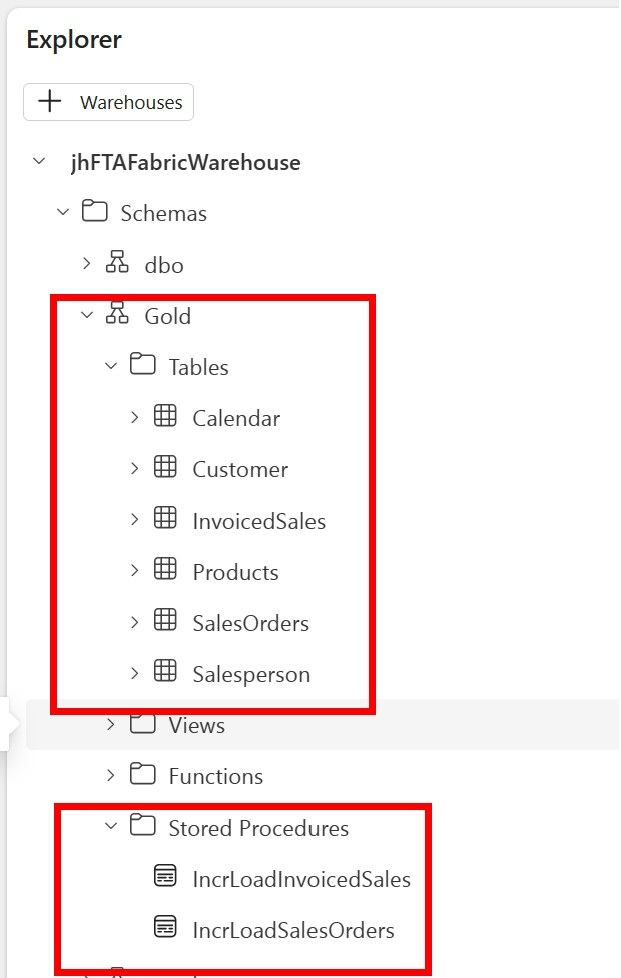
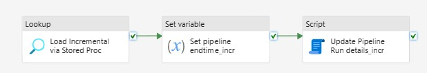
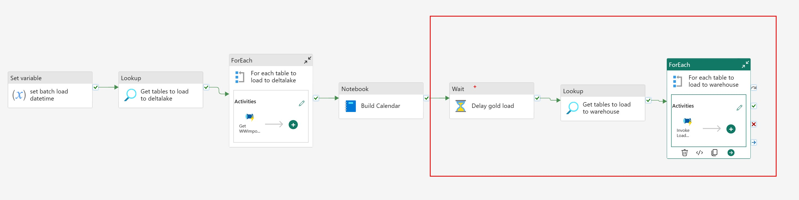
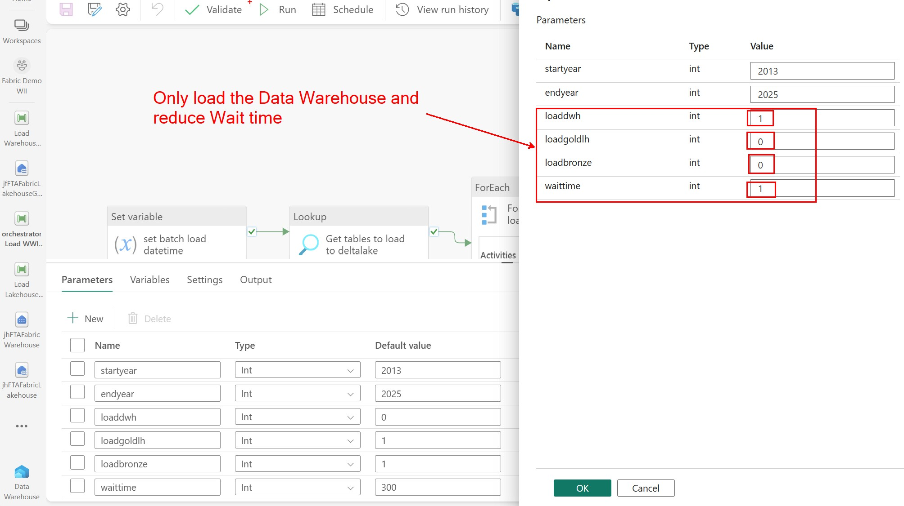

# Pattern 2: Load from Fabric Lakehouse to Fabric Data Warehouse
To complete this pipeline you will:

- Download and run the scripts to create the Fabric Datawarehouse Tables and Stored Procedures
- Create the pipeline to load data from the Fabric Lakehouse to the Data Warehouse
- Update the Orchestrator pipeline to do the Lookup against the Metadata Database table and call the new pipeline

## Create Fabric Data Warehouse Tables and Stored Procedures

Download the Datawarehouse SQL script file [located here](src/fabricdw/create-fabric-dw-objects.sql).
1. Open the downloaded SQL script (create-fabric-dw-objects.sql) using notepad and copy the entire contents of the script.
1. From the Fabric portal, go to your Fabric Workspace and open your Data Warehouse and [create a new Query](https://learn.microsoft.com/en-us/fabric/data-warehouse/query-warehouse).
1. Paste the code into the Fabric Data Warehouse query.
1. Do a Find and Replace **[Ctrl-H]** and replace the text **myFTAFabricWarehouse** with your Fabric Warehouse name.
1. Do another Find and Replace and replace the text **myFTAFabricLakehouse** with your Fabric Lakehouse name.
1. Run the SQL query script. After running the script, you should see the following tables and stored procedures in the Gold schema of your Fabric Data Warehouse:

## Create the pipeline to load from Fabric Lakehouse to Gold Data Warehouse

When this pipeline is complete, it will look like this: 

1. Create a new Data Pipeline called **Load Warehouse Table**
1. Add a **Set Variable** activity
1. Click on the canvas and create the following **Parameters**:
    | Name              | Type   |
    | ----------------- | ------ |
    | sourcestartdate   | String |
    | sourcestartdate   | String |
    | sourceenddate     | String |
    | sourceschema      | String |
    | sourcetable       | String |
    | sinkschema        | String |
    | loadtype          | String |
    | batchloaddatetime | String |
    | sinktable         | String |
    | storedprocschema  | String |
    | storedprocname    | String |
1. Add the following pipeline **Variables**:
    | Name              | Type   |
    | ----------------- | ------ |
    | pipelinestarttime | String |
    | pipelineendtime   | String |
1. Configure the **Set variable** activity created in step 2:
    | Tab      | Configuration | Value type         | Value                 |
    | -------- | ------------- | ------------------ | --------------------- |
    | General  | Name          | String             | Set pipelinestarttime |
    | Settings | Variable type | Radio Button       | Pipeline variable     |
    | Settings | Name          | String             | pipelinestarttime     |
    | Settings | Value         | Dynamic Content | @utcnow()             |
1. Add **If condition** activity, drag the green arrow from the previous activity to it and configure:
    | Tab        | Configuration | Value type         | Value                                          |
    | ---------- | ------------- | ------------------ | ---------------------------------------------- |
    | General    | Name          | String             | Check loadtype                                 |
    | Activities | Expression    | Dynamic Content | @equals(pipeline().parameters.loadtype,'full') |
1. Now configure the **If True** activities. Like the previous pipelines, the True activities will be a flow of activities when the table to be loaded should be a full load. When completed, the True activities will look like this:
    1. Add **Copy Data** activity and configure:
        | Tab         | Configuration               | Value Type         | Value                                                                              |
        | ----------- | --------------------------- | ------------------ | ---------------------------------------------------------------------------------- |
        | General     | Name                        | String             | Copy data to warehouse                                                             |
        | Source      | Data store type             | Radio Button       | Workspace                                                                          |
        | Source      | Workspace data store type   | Drop down          | Data Warehouse                                                                     |
        | Source      | Data Warehouse              | Drop down          | \<choose your Fabric Data Warehouse>                                 |
        | Source      | Use query                   | Radio Button       | Table                                                                              |
        | Source      | Table (Schema)              | Dynamic Content | @pipeline().parameters.sourceschema                                                |
        | Source      | Table (Table name)          | Dynamic Content | @pipeline().parameters.sourcetable                                                 |
        | Destination | Data store type             | Radio Button       | Workspace                                                                          |
        | Destination | Workspace data store type   | Drop down          | Dara Warehouse                                                                     |
        | Destination | Data Warehouse              | Drop down          | \<choose your Fabric Data Warehouse>                                                  |
        | Destination | Table Option                | Radio Button       | Use existing                                                                       |
        | Destination | Table (Schema)              | Dynamic Content | @pipeline().parameters.sinkschema                                                  |
        | Destination | Table (Table name)          | Dynamic Content | @pipeline().parameters.sinktable                                                   |
        | Destination | Advanced -> Pre-copy Script | Dynamic Content | DELETE FROM @{pipeline().parameters.sinkschema}.@{pipeline().parameters.sinktable} |
    1. Add **Set variable** activity, drag the green arrow from the previous activity to it and configure:
        | Tab      | Configuration | Value Type         | Value                |
        | -------- | ------------- | ------------------ | -------------------- |
        | General  | Name          | String             | Set pipeline endtime |
        | Settings | Variable type | Radio Button       | Pipeline variable    |
        | Settings | Name          | Dropdown           | pipelineendtime      |
        | Settings | Value         | Dynamic Content | @utcnow()            |
    1. Add **Script** activity, drag the green arrow from the previous activity to it and configure:
       | Tab      | Configuration   | Value Type   | Value                                             |
       | -------- | --------------- | ------------ | ------------------------------------------------- |
       | General  | Name            | String       | Update Pipeline Run details                       |
       | Settings | Data store type | Radio Button | External                                          |
       | Settings | Connection      | Dropdown     | Connection to FabricMetdataOrchestration Database |
       | Settings | Script(1)       | Radio Button | NonQuery                                          |
       | Settings | Script(2)       | Dynamic Content  | Update dbo.PipelineOrchestrator_FabricWarehouse set batchloaddatetime = '@{pipeline().parameters.batchloaddatetime}', loadstatus = '@{activity('Copy data to warehouse').output.executionDetails[0].status}',  rowsinserted= @{activity('Copy data to warehouse').output.rowsCopied}, rowsupdated=0, pipelinestarttime='@{variables('pipelinestarttime')}', pipelineendtime = '@{variables('pipelineendtime')}' where sourceschema = '@{pipeline().parameters.sourceschema}' and sourcetable = '@{pipeline().parameters.sourcetable}'   |
    1. Exit the **True activities** box of the **If condition** by clicking on  **Main canvas** in the upper left corner
1. Now configure the **If False** activities. Your False activities will be a flow of activities when the table to be loaded should be an incremental load. When completed, the False activities will look like this: 
    1. Add **Lookup** activity and configure:
        | Tab      | Configuration               | New parameter name | Paramater Type | Value Type         | Value                                                                             |
        | -------- | --------------------------- | ------------------ | -------------- | ------------------ | --------------------------------------------------------------------------------- |
        | General  | Name                        |                    |                | String             | Load Incremental via Stored Proc                                                  |
        | Settings | Data store type             |                    |                | Radio button       | Workspace                                                                         |
        | Settings | Workspace data store type   |                    |                | Drop down          | \<choose your Fabric Data Warehouse>    |
        | Settings | Use query                   |                    |                | Radio button       | Stored procedure                                                                  |
        | Settings | Stored procedure name       |                    |                | Dynamic Content | @{pipeline().parameters.storedprocschema}.@{pipeline().parameters.storedprocname} |
        | Settings | Stored procedure parameters | EndDate            | DateTime       | Dynamic Content | @pipeline().parameters.sourceenddate                                              |
        | Settings |                             | StartDate          | DateTime       | Dynamic Content | @pipeline().parameters.sourcestartdate                                            |
        | Settings | First row only              |                    |                | Check box          | Checked                                                                           |
    1. Add **Set variable** activity, drag the green arrow from the previous activity to it and configure:
        | Tab      | Configuration | Value Type         | Value                     |
        | -------- | ------------- | ------------------ | ------------------------- |
        | General  | Name          | String             | Set pipeline endtime_incr |
        | Settings | Variable type | Radio Button       | Pipeline variable         |
        | Settings | Name          | Dropdown           | pipelineendtime           |
        | Settings | Value         | Dynamic Content | @utcnow()                 |
    1. Add **Script** activity, drag the green arrow from the previous activity to it and configure:
        | Tab      | Configuration   | Value Type   | Value                                             |
        | -------- | --------------- | ------------ | ------------------------------------------------- |
        | General  | Name            | String       | Update Pipeline Run details_incr                  |
        | Settings | Data store type | Radio Button | External                                          |
        | Settings | Connection      | Dropdown     | Connection to FabricMetdataOrchestration Database |
        | Settings | Script(1)       | Radio Button | NonQuery                                          |
        | Settings | Script(2)       | Dynamic Content | Update dbo.PipelineOrchestrator_FabricWarehouse set batchloaddatetime = '@{pipeline().parameters.batchloaddatetime}', loadstatus = 'Succeeded', sinkmaxdatetime = '@{activity('Load Incremental via Stored Proc').output.firstRow.MaxDate}', sourcestartdate = '@{activity('Load Incremental via Stored Proc').output.firstRow.MaxDate}', rowsupdated = @{activity('Load Incremental via Stored Proc').output.firstRow.UpdateCount}, rowsinserted = @{activity('Load Incremental via Stored Proc').output.firstRow.InsertCount},  pipelinestarttime='@{variables('pipelinestarttime')}', pipelineendtime = '@{variables('pipelineendtime')}' where sourceschema = '@{pipeline().parameters.sourceschema}' and sourcetable = '@{pipeline().parameters.sourcetable}'  |
    1. Exit the **False activities** box of the **If condition** by clicking on  **Main canvas** in the upper left corner
## Configure the Orchestrator Pipeline to load from Fabric Lakehouse to Fabric Data Warehouse
Update the Orchestrator pipeline, **orchestrator Load WWI to Fabric**, to load data from the first Fabric Lakehouse to the Data Warehouse. When you are done, your pipeline should look like this: 
1. It can take up to 5 minutes from the time a table is created in the Fabric Lakehouse for it to be available in an endpoint. So we'll add a **Wait** activity. Drag the green arrow from the Build Calendar **Notebook** activity to it and configure:
    | Tab      | Configuration        | Value Type         | Value                           |
    | -------- | -------------------- | ------------------ | ------------------------------- |
    | General  | Name                 | String             | Delay gold load                 |
    | Settings | Wait time in seconds | Dynamic Content | @pipeline().parameters.waittime |
1. Add a **Lookup** activity.  Drag the green arrow from the **Wait** activity to it and configure:
    | Tab      | Configuration   | Value Type         | Value                                                                                                            |
    | -------- | --------------- | ------------------ | ---------------------------------------------------------------------------------------------------------------- |
    | General  | Name            | String             | Get tables to load to warehouse                                                                                  |
    | Settings | Data store type | Radio button       | External                                                                                                         |
    | Settings | Connection      | Drop down          | Connection to FabricMetdataOrchestration Database                                      |
    | Settings | Connection Type | Drop down          | Azure SQL Database                                                                                               |
    | Settings | Use query       | Radio button       | Query                                                                                                            |
    | Settings | Query           | Dynamic Content | select \* from dbo.PipelineOrchestrator_FabricWarehouse where skipload=0 and @{pipeline().parameters.loaddwh} =1 |
    | Settings | First row only  | Check box          | Not Checked                                                                                                      |
1. Add **For each** activity, drag the green arrow from the previous activity to it and configure:
    | Tab        | Configuration | Value Type                                    | Value                                                     |
    | ---------- | ------------- | --------------------------------------------- | --------------------------------------------------------- |
    | General    | Name          | String                                        | For each table to load to warehouse                       |
    | Settings   | Items         | Dynamic Content                            | @activity('Get tables to load to warehouse').output.value |
1. Click on the pencil in the **Activities** box of the **For each** and add an **Invoke Pipeline** activity and configure as follows:
    | Tab      | Configuration      | Parameter Name    | Value Type         | Value                           |
    | -------- | ------------------ | ----------------- | ------------------ | ------------------------------- |
    | General  | Name               |                   | String             | Invoke Load Warehouse Table     |
    | Settings | Invoked pipeline   |                   | Dropdown           | Load Warehouse Table            |
    | Settings | Wait on completion |                   | Checkbox           | Checked                         |
    | Settings | Parameters         | sourcestartdate   | Dynamic Content | @item().sourcestartdate         |
    | Settings | Parameters         | sourceenddate     | Dynamic Content | @item().sourceenddate           |
    | Settings | Parameters         | sourceschema      | Dynamic Content | @item().sourceschema            |
    | Settings | Parameters         | sourcetable       | Dynamic Content | @item().sourcetable             |
    | Settings | Parameters         | sinkschema        | Dynamic Content | @item().sinkschema              |
    | Settings | Parameters         | loadtype          | Dynamic Content | @item().loadtype                |
    | Settings | Parameters         | batchloaddatetime | Dynamic Content | @variables('batchloaddatetime') |
    | Settings | Parameters         | sinktable         | Dynamic Content | @item().sinktable               |
    | Settings | Parameters         | storedprocschema  | Dynamic Content | @item().storedprocschema        |
    | Settings | Parameters         | storedprocname    | Dynamic Content | @item().storedprocname          |
1. Exit the **Activities** box in the **For each** activity by clicking on  **Main canvas** in the upper left corner
 Save the **orchestrator Load WWI to Fabric** pipeline. Let's run it. If you already ran the pipelines to load to the the Fabric Lakeshouse, just run the load from the first or "Bronze" Lakehouse to the Data Warehouse. 

Your done! You have completed an End-to-End Metadata Driven Pipeline in Fabric!

Here are some additional resources to check out:

[Metadata Driven Pipelines for Microsoft Fabric - Part 2, Data Warehouse Style](https://techcommunity.microsoft.com/t5/fasttrack-for-azure/metadata-driven-pipelines-for-microsoft-fabric-part-2-data/ba-p/3906749)  
[Getting Started with Microsoft Fabric](https://learn.microsoft.com/en-us/fabric/get-started/)  
[Microsoft Fabric Lakehouse Overview](https://learn.microsoft.com/en-us/fabric/data-engineering/lakehouse-overview)  
[Data Factory in Microsoft Fabric](https://learn.microsoft.com/en-us/fabric/data-factory/)  
[Microsoft Fabric Data Warehouse Overview](https://learn.microsoft.com/en-us/fabric/data-warehouse/)  
[Microsoft Fabric Lakehouse vs Data Warehouse Decision Guide](https://learn.microsoft.com/en-us/fabric/get-started/decision-guide-warehouse-lakehouse)  
[James Serra - Lakeshoue vs Warehouse Video](https://www.jamesserra.com/archive/2023/07/microsoft-fabric-lakehouse-vs-warehouse-video/)
