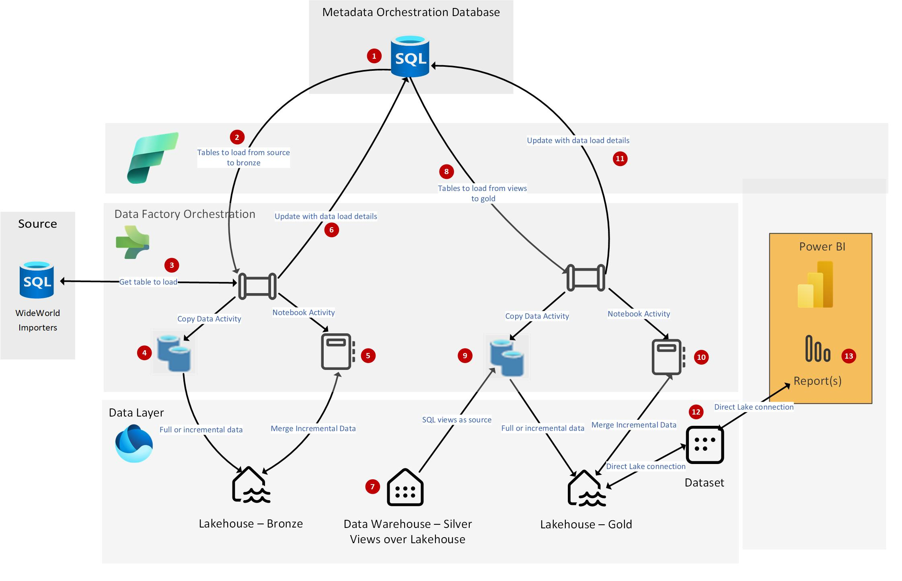
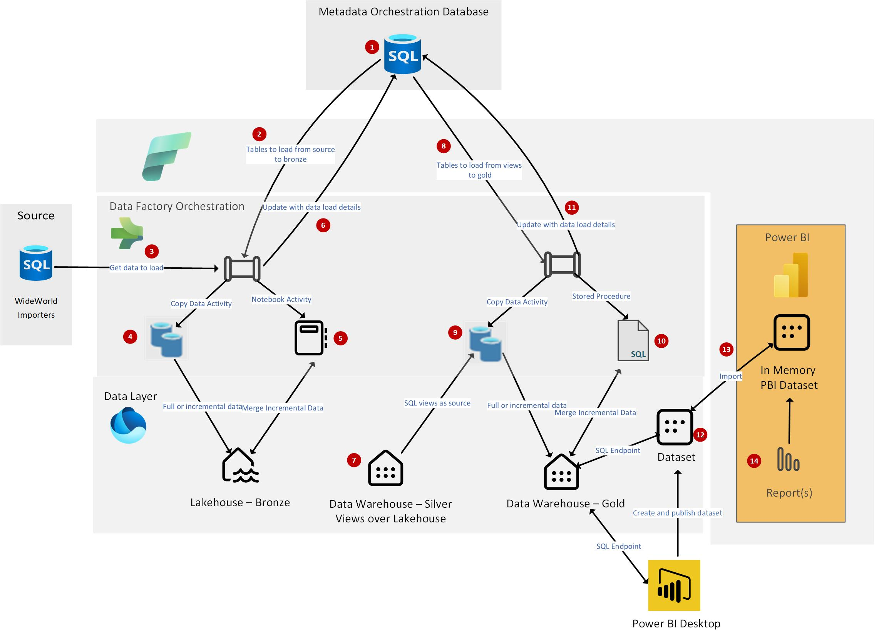
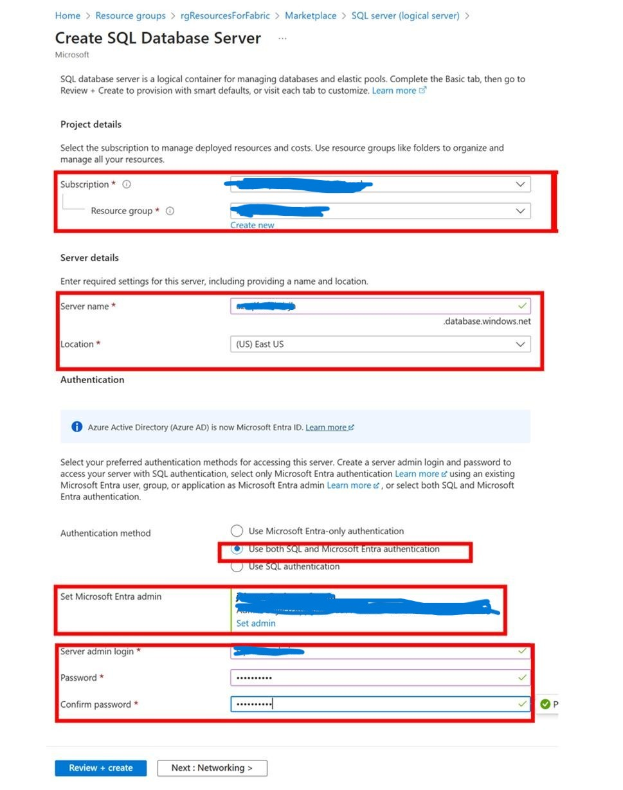
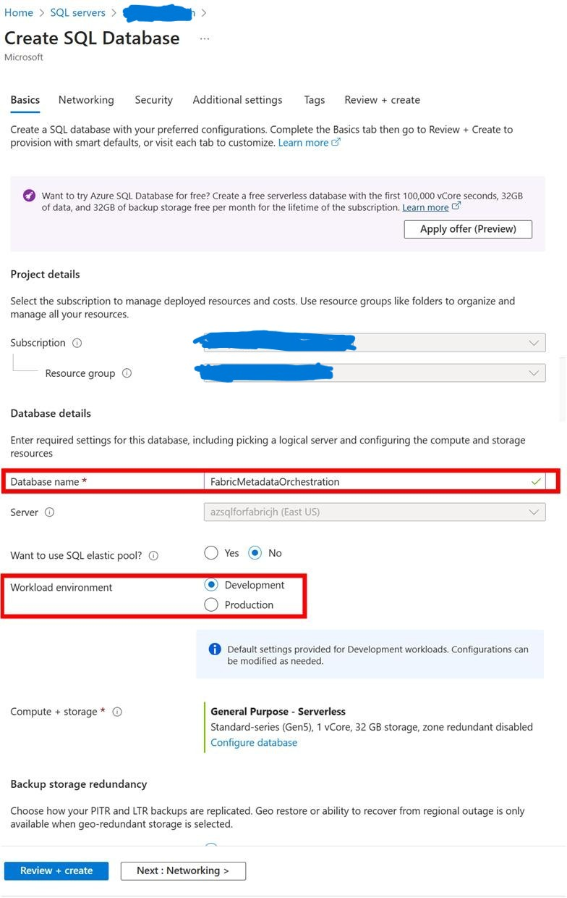
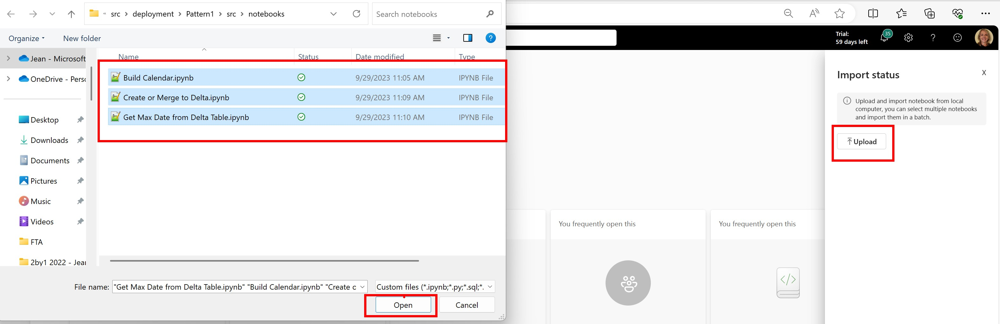
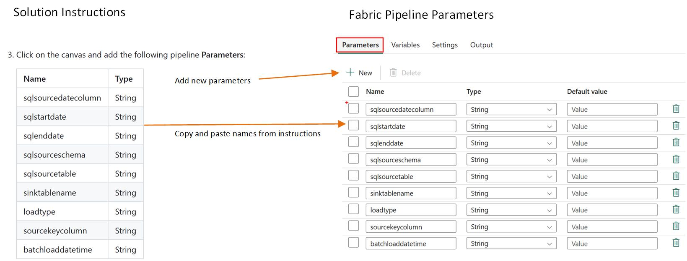
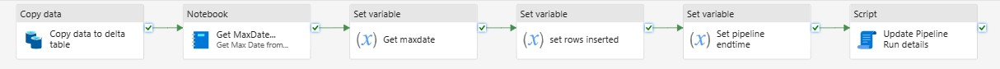
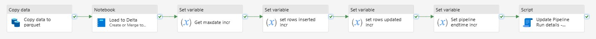

# Solution Guide: Build Metadata Driven Pipelines in Microsoft Fabric

## Description

Metadata-driven pipelines in Azure Data Factory, Synapse Pipelines, and now, Microsoft Fabric, give you the capability to ingest and transform data with less code, reduced maintenance and greater scalability than writing code or pipelines for every data source entity that needs to be ingested and transformed. The key lies in identifying the data loading and transformation pattern(s) for your data sources and destinations and then building the framework to support each pattern.

In August 2023, I created 2 blog posts on Metadata Driven Pipelines with Fabric. Both involve landing the data in a Fabric Lakehouse and building a Star Schema for the Gold Layer. [The first post](https://techcommunity.microsoft.com/t5/fasttrack-for-azure/metadata-driven-pipelines-for-microsoft-fabric/ba-p/3891651) illustrates creating the Star Schema in a Fabric Lakehouse. [The second post](https://techcommunity.microsoft.com/t5/fasttrack-for-azure/metadata-driven-pipelines-for-microsoft-fabric-part-2-data/ba-p/3906749) covers using a Fabric Data Warehouse for the Star Schema and why you may want to choose this option.

This solution guide is a companion to the Metadata Driven Pipelines in Fabric posts. The intent is to provide step-by-step instructions on how to build the Metadata Driven Pipelines described in those blogs. The reason is 2-fold - this will help you better understand Microsoft Fabric, but also because Fabric is not fully integrated with Git at this time. There are no ARM templates to deploy like in Azure Synapse or Data Factory. However, when Fabric supports Git integration with Pipelines and Connections, we will create another pattern which will allow you deploy all Fabric artifacts into your own Fabric tenant.

For both patterns, you will:

- Create Azure Resources, including a Resource Group, Storage Account, Azure SQL Server and Azure SQL DBs
- Create the Azure SQL DB objects, including the Metadata Driven Pipeline tables
- Create the Microsoft Fabric Resources
- Create Fabric Data Pipelines to Orchestrate and Load from the World Wide Importers Azure SQL DB to the Fabric Lakehouse
- Create Data Warehouse Objects

You then have the option to complete with Pattern 1 or 2 (or both!)

- Pattern 1: Load Data from the Lakehouse to a Star Schema in a Gold Lakehouse
- Pattern 2: Load Data from the Lakehouse to a Star Schema in a Data Warehouse

## Architecture
### Pattern 1:  End-to-End Metadata Driven Pipeline, From SQL to Lakehouse to Gold Lakehouse

 
### Pattern 2:  End-to-End Metadata Driven Pipeline, From SQL to Lakehouse to Data Warehouse

 
## Prerequisites
* Permissions to create the Azure Resource Group, Azure Storage Account, Azure SQL Server and Azure SQL DBs needed for this tutorial.
* Permissions to create a Microsoft Fabric Workspace
* SQL Server Management Studio or Azure Data Studio
* Basic understanding of creating data pipelines, either from Azure Data Factory, Synapse Analytics or Microsoft Fabric.
## Create Azure Resources
Create an Azure Resource Group, Storage Account, and Azure SQL DBs needed for this tutorial.
### Create an Azure Resource group 
 [Follow the instructions here](https://learn.microsoft.com/en-us/azure/azure-resource-manager/management/manage-resource-groups-portal), if neccessary, to create your resource group.
### Create an Azure Storage account
Create a blob storage account in the resource group created in the previous step. [Follow the instructions here](https://learn.microsoft.com/en-us/azure/storage/common/storage-account-create?tabs=azure-portal), if necessary, to create your blob storage account. This will be used to restore the Wide World Importers database.
### Create an Azure SQL Server
1. In the Azure Portal, in **Create a resource**, choose **SQL Server** and click **Create.**
1. Choose your **Subscription**
1. Choose you **Resource group** you created in the previous step
1. Enter a **Server name** - note this must be unique across all azure
1. Choose your **location**
1. For authentication method, select **Use both SQL and Microsoft authentication**
1. Click the **Set admin** button and select your user account
1. Enter a **Server admin login and password**. Your screen should similar to the one below: 
1. Navigate to the **Networking** tab and change the slider under Firewall rules to **Yes** to allow Azure services and resources to access this server.
1. Select **Review + create**
### Create an Azure SQL DB for Metadata Driven Pipeline Configurations
1. Go to the Azure SQL Server you created in the previous step and click **Create database**
1. Make sure your resource group and SQL server are selected. Enter **FabricMetadataOrchestration** for the database name.
1. For **Workload environment** Choose **Development**
1. Navigate to **Networking** and under **Firewall rules**, move slider for **Add current client IP address** to **Yes** 
1. Click **Review and create**
### Download and restore the Wide World Importers Database
1. Download the Wide World Importers Database for Azure SQL DB. [Click here to immediately download the bacpac](https://github.com/Microsoft/sql-server-samples/releases/download/wide-world-importers-v1.0/WideWorldImporters-Standard.bacpac)
1. Upload the bacpac to the storage account created previously and restore the Wide World Importers database. [Follow the instructions here](https://learn.microsoft.com/en-us/azure/azure-sql/database/database-import?view=azuresql&tabs=azure-powershell), if necessary, to restore the database from the bacpac.
## Create Azure SQL DB Objects
Run scripts to create views, tables and stored procedures used in this tutorial.
### Create views in Wide World Importers database
1. Download the SQL script found in [in this repo](src/sql/1-wwi/create_source_views.sql).
1. Connect to the Wide World Importers Database in SQL Server Management Studio or Azure Data Studio
1. Run the script to script to create the views. You should see the following views as shown in Object Explorer below: 
### Create and load tables in the Metadata database
1. Download the SQL script found in [in this repo](src/sql/2-metadatadb/create-metadata-tables.sql)
1. Connect to the FabricMetadataOrchestration database in SQL Server Management Studio or Azure Data Studio
1. Run the script to script to create and load the tables. You should see the following tables as shown below: 
Notice the values for the **loadtype**, **sqlsourcedatecolumn**, **sqlstartdate**, and **sqlenddate** columns of the **PipelineOrchestrator_FabricLakehouse** table. For the tables with **loadtype** equal to **'incremental'**, only 1 weeks worth of data will be loaded. This is because these tables are very large so for testing purposes, we only need a small amount of data. After these tables are loaded into the Lakehouse, the **sqlstartdate** will be updated to the max date of each column indicated in the **sqlsourcedatecolumn** for each table. This means that if you run the pipeline again without resetting the **sqlenddate**, no new data will be added to the tables that are incrementally loaded. You may be tempted to set the **sqlenddate** to NULL, which is what the value would be for scheduled loads in production, but I would caution you against doing that in this solution without testing how long the load from the World Wide Importers database to the Lakehouse runs. Instead, update the **sqlenddate** to add just a few more days worth of data after the inital run of just one week's data to test the incremental load logic.

## Create Microsoft Fabric Resources
Create the Microsoft Fabric Workspace, Lakehouses, Data Warehouse, and Azure SQL DB Connections.
### Create a Microsoft Fabric workspace
[Create a Fabric Workspace](https://learn.microsoft.com/en-us/fabric/get-started/create-workspaces) in your Microsoft Fabric tenant
### Create Bronze and Gold Fabric Lakehouses
[Create 2 Microsoft Fabric Lakehouses](https://learn.microsoft.com/en-us/fabric/data-engineering/create-lakehouse) in you workspace.
After creating the Lakehouses, copy the lakehouse names and table URLs and keep for your reference. 
* To get the URLs, open each Lakehouse and click on the ellipses next to the **Tables** folder. Choose **Properties** and copy the abfss file path. 
* Paste each into notepad or a Word document and remove the "/Tables" from the end of the string. Your string will look something like **abfss://\<uniqueid>@onelake.dfs.fabric.microsoft.com/a\<anotheruniqueid>**
### Create a Fabric Data Warehouse
Create a Fabric Data Warehouse by [following the instructions here](https://learn.microsoft.com/en-us/fabric/data-warehouse/create-warehouse). 

You need the Fabric Data Warehouse since it contains the SQL views required to load from the Lakehouse to the Gold Lakehouse OR Data Warehouse. Views defined in the Lakehouse SQL Endpoint are not exposed in a Copy Data Activity so the views live in the Data Warehouse for both patterns.

### Create Fabric Connections to your Azure SQL DBs
Create 2 Fabric connections, one to the Wide World Importers Azure SQL DB and to the FabricMetadataConfiguration Azure SQL DB [per the instructions here](https://learn.microsoft.com/en-us/fabric/data-factory/connector-azure-sql-database).
### Upload Spark Notebooks to Fabric
Upload the notebooks to be used in the pipeline
1. Download the 3 notebooks [found in the repo](src/notebooks/)
1. Log into the Microsoft Fabric portal and switch to the Data Engineering experience and click **Import notebook**
1. Select upload and choose all of the 3 notebooks to your Fabric Workspace. 

## Create Pipelines to Load Data from World Wide Importers to Fabric Lakehouse

### Instructions for building the Data Pipelines
From this point forward, the instructions will be an exercise of creating pipelines, adding activities and configuring the settings for each activity. The configurations for each activity are in a table that allows you to copy and paste values into each activity. It is important to copy the text exactly as is to avoid errors in scripts or subsequent activities. Here's a couple of examples:

The instructions above are telling you to go to the pipeline **Parameters**, add 9 new parameters of type string, and copy each parameter name from the table to the parameter name in the pipeline.

The instructions  above are for configuring a **Set Variable** activity. First go to the **General** tab, and copy the Value from the table to the **Name** configuration. Then go to the **Settings** tab, for **Variable type** click the Radio Button and choose **Pipeline variable**; for **Name**, copy the value pipelinestarttime from the table and paste it into the setting box; for the **Value** configuration, click on the **Add dynamic content** link and copy and paste the value \@utcnow() into the Pipeline expression builder.

Due to the length of the instructions, I am keeping images in this post to a minimum - another reason to follow the instructions carefully. You can also refer to the original blog posts cited at the tops of this blog post for reference.
### Create the pipeline and activities
This pipeline loops through the tables defined in PipelineOrchestrator_FabricLakehouse table to load from World Wide Importers to the Fabric Lakehouse. The pipeline will look like this when finished: 

1. Create a new Data Pipeline and call it "**Get WWImporters Data direct**"
1. Add a **Set variable** activity
1. Click on the canvas and add the following  pipeline **Parameters**:

      Name                | Type   |
     ------------------- | ------ |
     sqlsourcedatecolumn | String |
     sqlstartdate        | String |
     sqlenddate          | String |
     sqlsourceschema     | String |
     sqlsourcetable      | String |
     sinktablename       | String |
     loadtype            | String |
     sourcekeycolumn     | String |
     batchloaddatetime   | String |
1. Move to the **Variables** tab and add the following variables: 

    | Name              | Type   |
    | ----------------- | ------ |
    | datepredicate     | String |
    | maxdate           | String |
    | rowsinserted      | String |
    | rowsupdated       | String |
    | pipelinestarttime | String |
    | pipelineendtime   | String |
1. Configure the **Set variable** activity created in the 2nd step:

    | Tab      | Configuration | Value Type         | Value                 |
    | -------- | ------------- | ------------------ | --------------------- |
    | General  | Name          | String             | Set pipelinestarttime |
    | Settings | Variable type | Radio Button       | Pipeline variable     |
    | Settings | Name          | String             | pipelinestarttime     |
    | Settings | Value         | Dynamic Content | @utcnow()             |
1. Add another **Set variable**, drag the green arrow from the previous activity to it and configure:

    | Tab      | Configuration | Value Type   | Value              |
    | -------- | ------------- | ------------ | ------------------ |
    | General  | Name          | String       | Set Date predicate |
    | Settings | Variable type | Radio Button | Pipeline variable  |
    | Settings | Name          | String       | datepredicate      |
    | Settings | Value         | Dynamic Content |@if(equals(pipeline().parameters.sqlenddate,null),concat(pipeline().parameters.sqlsourcedatecolumn,' >= ''', pipeline().parameters.sqlstartdate,''''),concat(pipeline().parameters.sqlsourcedatecolumn, ' >= ''',pipeline().parameters.sqlstartdate,''' and ', pipeline().parameters.sqlsourcedatecolumn,' < ''',pipeline().parameters.sqlenddate,'''')) |
1. Add **If condition** activity, drag arrow from previous activity and configure:
    | Tab        | Configuration | Value Type         | Value                                          |
    | ---------- | ------------- | ------------------ | ---------------------------------------------- |
    | General    | Name          | String             | Check loadtype                                 |
    | Activities | Expression    | Dynamic Content | @equals(pipeline().parameters.loadtype,'full') |
1. Now configure the **If True** activities. Your True activities will be a flow of activities when the table to be loaded should be a full load. When completed, the True activities will look like this: 
    1. Add **Copy Data** activity and configure:
        | Tab     | Configuration   | Value Type   | Value                           |
        | ------- | --------------- | ------------ | ------------------------------- |
        | General | Name            | String       | Copy data to delta table        |
        | Source  | Data store type | Radio button | External                        |
        | Source  | Connection      | Drop down    | \<choose your World Wide Importers database connection> |
        | Source  | Connection type | Drop down    | Azure SQL Database              |
        | Source  | User query      | Radio button | Query                           |
        | Source  | Query           | Dynamic Content | select * from @{pipeline().parameters.sqlsourceschema}.@{pipeline().parameters.sqlsourcetable} where  @{variables('datepredicate')} |
        | Destination | Data store type           | Radio button       | Workspace                            |
        | Destination | Workspace data store type | Drop down          | Lakehouse                            |
        | Destination | Lakehouse                 | Drop down          | \<choose your Fabric Lakehouse>              |
        | Destination | Root folder               | Radio button       | Tables                               |
        | Destination | Table name                | Dynamic Content | @pipeline().parameters.sinktablename |
        | Destination | Advanced-> Table action   | Radio button       | Overwrite                            |
    1. Add **Notebook** activity, drag arrow from previous activity and configure:
        | Tab      | Configuration               | Add New Parameter | Value Type         | Value                                      |
        | -------- | --------------------------- | ----------------- | ------------------ | ------------------------------------------ |
        | General  | Settings                    |                   | String             | Get MaxDate loaded                         |
        | Settings | Notebook                    |                   | Dropdown           | Get Max Data from Delta Table              |
        | Settings | Advanced -> Base parameters | lakehousePath     | String             | \<enter your Bronze Lakehouse abfss path>          |
        | Settings | Advanced -> Base parameters | tableName         | Dynamic Content | @pipeline().parameters.sinktablename       |
        | Settings | Advanced -> Base parameters | tableKey          | Dynamic Content | @pipeline().parameters.sourcekeycolumn     |
        | Settings | Advanced -> Base parameters | dateColumn        | Dynamic Content | @pipeline().parameters.sqlsourcedatecolumn |
    1. Add **Set variable**, drag the green arrow from the previous activity to it and configure:
        | Tab      | Configuration | Value Type         | Value                                                                               |
        | -------- | ------------- | ------------------ | ----------------------------------------------------------------------------------- |
        | General  | Name          | String             | Get maxdate                                                                         |
        | Settings | Variable type | Radio Button       | Pipeline variable                                                                   |
        | Settings | Name          | Dropdown           | maxdate                                                                             |
        | Settings | Value         | Dynamic Content | @split(split(activity('Get MaxDate loaded').output.result.exitValue,'\|')[0],'=')[1] |
    1. Add another **Set variable**, drag the green arrow from the previous activity to it and configure:
        | Tab      | Configuration | Value Type   | Value             |
        | -------- | ------------- | ------------ | ----------------- |
        | General  | Name          | String       | set rows inserted |
        | Settings | Variable type | Radio Button | Pipeline variable |
        | Settings | Name          | Dropdown     | rowsinserted      |
        | Settings | Value         | Dynamic Content | @split(split(activity('Get MaxDate loaded').output.result.exitValue,'\|')[1],'=')[1] |
    1. Add another **Set variable**, drag the green arrow from the previous activity to it and configure:
        | Tab      | Configuration | Value Type         | Value                |
        | -------- | ------------- | ------------------ | -------------------- |
        | General  | Name          | String             | Set pipeline endtime |
        | Settings | Variable type | Radio Button       | Pipeline variable    |
        | Settings | Name          | Dropdown           | pipelineendtime      |
        | Settings | Value         | Dynamic Content | @utcnow()            |
    1. Add  **Script**, drag the green arrow from the previous activity to it and configure:
        | Tab      | Configuration   | Value Type   | Value                           |
        | -------- | --------------- | ------------ | ------------------------------- |
        | General  | Name            | String       | Update Pipeline Run details     |
        | Settings | Data store type | Radio Button | External                        |
        | Settings | Connection      | Dropdown     | Connection to FabricMetdataOrchestration Database |
        | Settings | Script          | Radio Button | NonQuery                        |
        | Settings | Script          | Dynamic Content  | Update dbo.PipelineOrchestrator_FabricLakehouse set batchloaddatetime = '@{pipeline().parameters.batchloaddatetime}', loadstatus = '@{activity('Copy data to delta table').output.executionDetails[0].status}', rowsread = @{activity('Copy data to delta table').output.rowsRead}, rowscopied= @{activity('Copy data to delta table').output.rowsCopied}, deltalakeinserted = '@{variables('rowsinserted')}', deltalakeupdated =0, sqlmaxdatetime = '@{variables('maxdate')}', pipelinestarttime='@{variables('pipelinestarttime')}', pipelineendtime = '@{variables('pipelineendtime')}' where sqlsourceschema = '@{pipeline().parameters.sqlsourceschema}' and sqlsourcetable = '@{pipeline().parameters.sqlsourcetable}' |
    1. Exit the **True activities** box of the **If condition** by clicking on  **Main canvas** in the upper left corner
1. Now configure the **If False** activities. Your False activities will be a flow of activities when the table to be loaded should be an incremental load. When completed, the False activities will look like this: 
    1. Add **Copy Data** activity:
        | Tab     | Configuration   | Value Type   | Value                           |
        | ------- | --------------- | ------------ | ------------------------------- |
        | General | Name            | String       | Copy data to parquet            |
        | Source  | Data store type | Radio button | External                        |
        | Source  | Connection      | Drop down    | \<choose your World Wide Importers database connection> |
        | Source  | Connection type | Drop down    | Azure SQL Database              |
        | Source  | User query      | Radio button | Query                           |
        | Source  | Query      | Dynamic Content | select * from @{pipeline().parameters.sqlsourceschema}.@{pipeline().parameters.sqlsourcetable} where  @{variables('datepredicate')} |
        | Destination | Data store type           | Radio button | Workspace               |
        | Destination | Workspace data store type | Drop down    | Lakehouse               |
        | Destination | Lakehouse                 | Drop down    | \<choose your Fabric Lakehouse> |
        | Destination | Root folder               | Radio button | Files                   |
        | Destination  | File Path (1)  | Dynamic Content | incremental/@{pipeline().parameters.sinktablename} |
        | Destination  | File Path (2)  | Dynamic Content | @{pipeline().parameters.sinktablename}.parquet |
        | Destination  | File format      | Drop down | Parquet |
    1. Add **Notebook** activity, drag the green arrow from previous activity and configure:
        | Tab      | Configuration               | Add New Parameter | Value Type         | Value                                      |
        | -------- | --------------------------- | ----------------- | ------------------ | ------------------------------------------ |
        | General  | Settings                    |                   | String             | Load to Delta                              |
        | Settings | Notebook                    |                   | Dropdown           | Create or Merge to Deltalake               |
        | Settings | Advanced -> Base parameters | lakehousePath     | String             | \<enter your Bronze Lakehouse abfss path>          |
        | Settings | Advanced -> Base parameters | tableName         | Dynamic Content | @pipeline().parameters.sinktablename       |
        | Settings | Advanced -> Base parameters | tableKey          | Dynamic Content | @pipeline().parameters.sourcekeycolumn     |
        | Settings | Advanced -> Base parameters | dateColumn        | Dynamic Content | @pipeline().parameters.sqlsourcedatecolumn |
    1. Add **Set variable**, drag the green arrow from the previous activity to it and configure:
        | Tab      | Configuration | Value Type         | Value                                                                          |
        | -------- | ------------- | ------------------ | ------------------------------------------------------------------------------ |
        | General  | Name          | String             | Get maxdate incr                                                               |
        | Settings | Variable type | Radio Button       | Pipeline variable                                                              |
        | Settings | Name          | Dropdown           | maxdate                                                                        |
        | Settings | Value         | Dynamic Content | @split(split(activity('Load to Delta').output.result.exitValue,'\|')[0],'=')[1] |
    1. Add **Set variable**, drag the green arrow from the previous activity to it and configure:
        | Tab      | Configuration | Value Type         | Value                                                                          |
        | -------- | ------------- | ------------------ | ------------------------------------------------------------------------------ |
        | General  | Name          | String             | set rows inserted incr                                                         |
        | Settings | Variable type | Radio Button       | Pipeline variable                                                              |
        | Settings | Name          | Dropdown           | rowsinserted                                                                   |
        | Settings | Value         | Dynamic Content | @split(split(activity('Load to Delta').output.result.exitValue,'\|')[1],'=')[1] |
    1. Add **Set variable**, drag the green arrow from the previous activity to it and configure:
        | Tab      | Configuration | Value Type         | Value                                                                          |
        | -------- | ------------- | ------------------ | ------------------------------------------------------------------------------ |
        | General  | Name          | String             | set rows updated incr                                                          |
        | Settings | Variable type | Radio Button       | Pipeline variable                                                              |
        | Settings | Name          | Dropdown           | rowsupdated                                                                    |
        | Settings | Value         | Dynamic Content | @split(split(activity('Load to Delta').output.result.exitValue,'\|')[2],'=')[1] |
    1. Add **Set variable**, drag the green arrow from the previous activity to it and configure:
        | Tab      | Configuration | Value Type         | Value                     |
        | -------- | ------------- | ------------------ | ------------------------- |
        | General  | Name          | String             | Set pipeline endtime incr |
        | Settings | Variable type | Radio Button       | Pipeline variable         |
        | Settings | Name          | Dropdown           | pipelineendtime           |
        | Settings | Value         | Dynamic Content | @utcnow()                 |
    1. Add  **Script**, drag the green arrow from the previous activity to it and configure:
        | Tab      | Configuration   | Value Type   | Value                                             |
        | -------- | --------------- | ------------ | ------------------------------------------------- |
        | General  | Name            | String       | Update Pipeline Run details - incremental         |
        | Settings | Data store type | Radio Button | External                                          |
        | Settings | Connection      | Dropdown     | Connection to FabricMetdataOrchestration Database |
        | Settings | Script(1)       | Radio Button | NonQuery                                          |
        | Settings | Script(2)       | Dynamic Content | Update dbo.PipelineOrchestrator_FabricLakehouse set batchloaddatetime = '@{pipeline().parameters.batchloaddatetime}', loadstatus = '@{activity('Copy data to parquet').output.executionDetails[0].status}', rowsread = @{activity('Copy data to parquet').output.rowsRead}, rowscopied= @{activity('Copy data to parquet').output.rowsCopied},deltalakeinserted = '@{variables('rowsinserted')}',deltalakeupdated = '@{variables('rowsupdated')}', sqlmaxdatetime = '@{variables('maxdate')}', sqlstartdate = '@{variables('maxdate')}', pipelinestarttime='@{variables('pipelinestarttime')}', pipelineendtime = '@{variables('pipelineendtime')}'  where sqlsourceschema = '@{pipeline().parameters.sqlsourceschema}' and sqlsourcetable = '@{pipeline().parameters.sqlsourcetable}' |
    1. Exit the **False activities** box of the **If condition** by clicking on  **Main canvas** in the upper left corner
If you have gotten this far, awesome! Thank you! Save your changes! You are done with your first pipeline!

### Create the Orchestration Pipeline
To run the pipeline, we will create an Orchestrator pipeline. An Orchestrator pipeline is the main pipeline that coordinates the flow and execution of all pipeline activities, including calling other pipelines. When you are finished, your Orchestrator Pipeline will look like this: 
1. Create a new Data Pipeline called **orchestrator Load WWI to Fabric**
1. Add a **Set Variable** activity
1. Click on the canvas and create the following **Parameters**:
   | Name       | Type | Default Value | Description                                             |
   | ---------- | ---- | ------------- | ------------------------------------------------------- |
   | startyear  | int  | 2013          | Year to start loading from WWI                          |
   | endyear    | int  | 2025          | Year to end loading from WWI                            |
   | loaddwh    | int  | 0             | Set to 1 if you want to load to Fabric Data Warehouse   |
   | loadgoldlh | int  | 1             | Set to 1 if you want to load to Fabric Gold Lakehouse   |
   | loadbronze | int  | 1             | Set to 1 if you want to load to Fabric Bronze Lakehouse |
   | waittime | int  | 300            | Delay needed for tables to materialize in Bronze Lakehouse before loading to DW or Gold LH. Can set to 1 if not loading Bronze or only loading to Bronze |
1. Add pipeline **Variables**
   | Name              | Type   |
   | ----------------- | ------ |
   | batchloaddatetime | String |
1. Go back to the **Set variable** activity you added in step 2 and configure:
   | Tab      | Configuration | Value Type         | Value                   |
   | -------- | ------------- | ------------------ | ----------------------- |
   | General  | Name          | String             | set batch load datetime |
   | Settings | Variable type | Radio Button       | Pipeline variable       |
   | Settings | Name          | Dropdown           | batchloaddatetime       |
   | Settings | Value         | Dynamic Content | @pipeline().TriggerTime |
1. Add **Lookup** activity, drag the green arrow from the previous activity to it and configure:
   | Tab      | Configuration   | Value Type   | Value                                |
   | -------- | --------------- | ------------ | ------------------------------------ |
   | General  | Name            | String       | Get tables to load to deltalake      |
   | Settings | Data store type | Radio button | External                             |
   | Settings | Connection      | Drop down    | Connection to FabricMetdataOrchestration Database |
   | Settings | Connection Type | Drop down    | Azure SQL Database                   |
   | Settings | Use query       | Radio button | Query                                |
   | Settings | Query       | Dynamic Content |select * from dbo.PipelineOrchestrator_FabricLakehouse where skipload=0 and 1=@{pipeline().parameters.loadbronze} |
   | Settings | First row only      | Check box | Not Checked                                |
1. Add **For each** activity, drag the green arrow from the previous activity to it and configure:
   | Tab        | Configuration | Value Type                                    | Value                                                     |
   | ---------- | ------------- | --------------------------------------------- | --------------------------------------------------------- |
   | General    | Name          | String                                        | For each table to load to deltalake                       |
   | Settings   | Batch count   | String                                        | 4                                                         |
   | Settings   | Items         | Dynamic Content                            | @activity('Get tables to load to deltalake').output.value |
                                                        
1. Click on the pencil in the **Activities** box of the **For Each** and add an **Invoke Pipeline** activity and configure as follows:
   | Tab      | Configuration      | Parameter Name      | Value Type         | Value                           |
   | -------- | ------------------ | ------------------- | ------------------ | ------------------------------- |
   | General  | Name               |                     | String             | Get WWImporters Data            |
   | Settings | Invoked pipeline   |                     | Dropdown           | Get WWI Importers Data direct   |
   | Settings | Wait on completion |                     | Checkbox           | Checked                         |
   | Settings | Parameters         | sqlsourcedatecolumn | Dynamic Content | @item().sqlsourcedatecolumn     |
   | Settings | Parameters         | sqlstartdate        | Dynamic Content | @item().sqlstartdate            |
   | Settings | Parameters         | sqlenddate          | Dynamic Content | @item().sqlenddate              |
   | Settings | Parameters         | sqlsourceschema     | Dynamic Content | @item().sqlsourceschema         |
   | Settings | Parameters         | sqlsourcetable      | Dynamic Content | @item().sqlsourcetable          |
   | Settings | Parameters         | sinktablename       | Dynamic Content | @item().sinktablename           |
   | Settings | Parameters         | loadtype            | Dynamic Content | @item().loadtype                |
   | Settings | Parameters         | sourcekeycolumn     | Dynamic Content | @item().sourcekeycolumn         |
   | Settings | Parameters         | batchloaddatetime   | Dynamic Content | @variables('batchloaddatetime') |
1. Exit the **Activities** box in the For each activity by clicking on  **Main canvas** in the upper left corner
1. On the Main Canvas, add **Notebook** activity, drag the green arrow from the **For each** activity to it and configure:
   | Tab      | Configuration   | Add New Parameter | Parameter Type | Value Type         | Value                            |
   | -------- | --------------- | ----------------- | -------------- | ------------------ | -------------------------------- |
   | General  | Name            |                   |                | String             | Build Calendar                   |
   | Settings | Notebook        |                   |                | Dropdown           | Build Calendar                   |
   | Settings | Base parameters | startyear         | int            | Dynamic Content | @pipeline().parameters.startyear |
   | Settings | Base parameters | endyear           | int            | Dynamic Content | @pipeline().parameters.endyear   |
   | Settings | Base parameters | lakehousePath     | String         |String  | \<enter your Bronze Lakehouse abfss path>          |

Run the Orchestrator pipeline to load the Lakehouse. When it is complete, you should see the following tables and files in your Lakehouse: 

Now that we have the tables in our Fabric Lakehouse, we can create SQL views over them which will be used to load our Fabric Gold Lakehouse and/or our Fabric Data Warehouse.

## Create Data Warehouse Views
If you read the original blog posts, you would know that at this point in time the Lakehouse SQL Endpoint is not exposed in the Copy Data pipeline activity. So while you can build SQL views in the Lakehouse, you can not leverage them in a Copy Data activity. Therefore, we will create the SQL Views in the Fabric Data Warehouse.
1. Download the Datawarehouse SQL script file [located here](src/fabricdw/create-fabric-dw-objects.sql).
1. Open the downloaded SQL script (create-fabric-dw-objects.sql) using notepad and copy the entire contents of the script.
1. From the Fabric portal, go to you Fabric Workspace and open your Data Warehouse and 
[create a new Query](https://learn.microsoft.com/en-us/fabric/data-warehouse/query-warehouse).
1. Paste the code into the Fabric Data Warehouse query.
1. Do a Find and Replace **[Ctrl-H]** and replace the text **myFTAFabricWarehouse** with your Fabric Warehouse name.
1. Do another Find and Replace and replace the text **myFTAFabricLakehouse** with your Fabric Lakehouse name.
1. Run the SQL query script. You should see the following objects in you Fabric Data Warehouse after running the script: 
    1. 1. Notice the script also creates Tables and Stored Procedures in the Gold schema. These are only used in Pattern 2. You can delete them if you never plan to implement Pattern 2, but it doesn't hurt to have them.

Now we have the views needed to load the Star Schema for either the the Gold Fabric Lakehouse or the Fabric Data Warehouse. Now the decision is yours: Do you want to build your Gold Layer/Star Schema in another Fabric Lakehouse ala Pattern 1? Or does the Fabric Data Warehouse better suit your needs?

- [Pattern 1: Build Star Schema in Fabric Lakehouse](/Fabric/src/deployment/Pattern1and2/PATTERN1_LAKEHOUSE.md)
- [Pattern 2: Build Star Schema in Fabric Data Warehouse](/Fabric/src/deployment/Pattern1and2/PATTERN2_DATAWAREHOUSE.md)