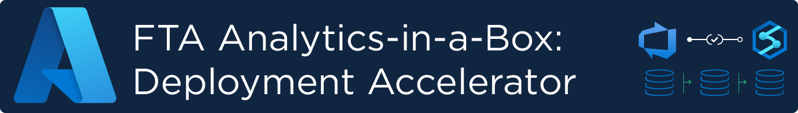

## 
&nbsp;

Getting up and running with Synapse can be a complex undertaking with some organizations and engineers getting blocked on their first scenario. Having an easy to understand and intuitive template that they can rely on that will demonstrate what the overall life cycle can look like, how the ingestion pipelines should be set up, and how the data goes from raw to curated in their Delta Lake.  
This project aims to provide an “Synapse Easy Button” for common scenarios. Something that shows how the pieces fit together in easy to deploy templates. Using the **patterns** available here, engineers will be able to quickly setup a Synapse environment which optionally includes streaming & batch ingestion, Data Lake with zones, Delta tables as well as meta-driven pipelines.

| Key Contacts | GitHub ID | Email |
|--------------|------|-----------|
| Samarendra Panda | @Sam-Panda | sapa@microsoft.com | 
| Neeraj Jhaveri | @neerajjhaveri | neeraj.jhaveri@microsoft.com | 
| Andrés Padilla | @AndresPad | andres.padilla@microsoft.com | 
| Kathryn Varrall | | kavarral@microsoft.com | 
| Situmalli Chandra Mohan | @svchandramohan | schandra@microsoft.com |
| Ben Harding | @BennyHarding | ben.harding@microsoft.com

## Architecture
The below architecture diagram is an example of a complex data analytics deployment, using many Azure services and technologies. While this may be an end-state architecture, it is likely too complex to build in a 'big bang' approach which is why this repository has broken this architecture into small **patterns** that can be deployed independently.  

##   
&nbsp;

## Available Patterns
This repository contains several scenarios, or, 'patterns' for you to deploy into your own environment. Below is a summary:
* **Pattern 1**: Azure Synapse Analytics workspace with a Data Lake and Serverless & Dedicated SQL Pools.
* **Pattern 2**: Azure Synapse Analytics workspace with a Data Lake, Serverless & Dedicated SQL Pools and Spark Pools.
* **Pattern 3**: Streaming solution with an Azure Function (Event Generator), Event Hubs, Synapse with Spark Pool and Streaming Notebook and a Data Lake (ADLSv2). Deployed via Azure DevOps.
* **Pattern 4**: Batch loading example from a source SQL database through to a Data Lake using Synapse Spark.

