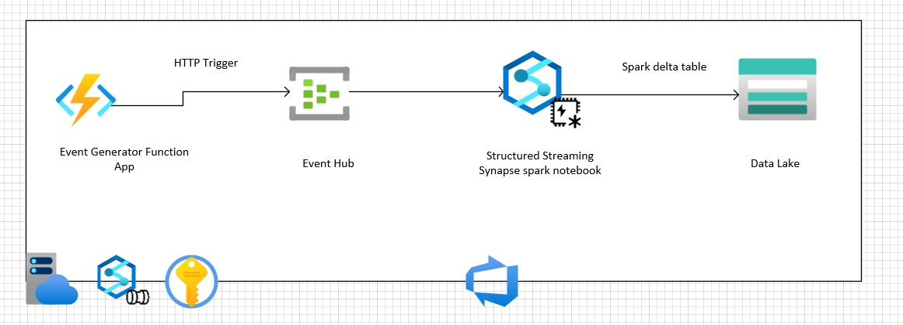
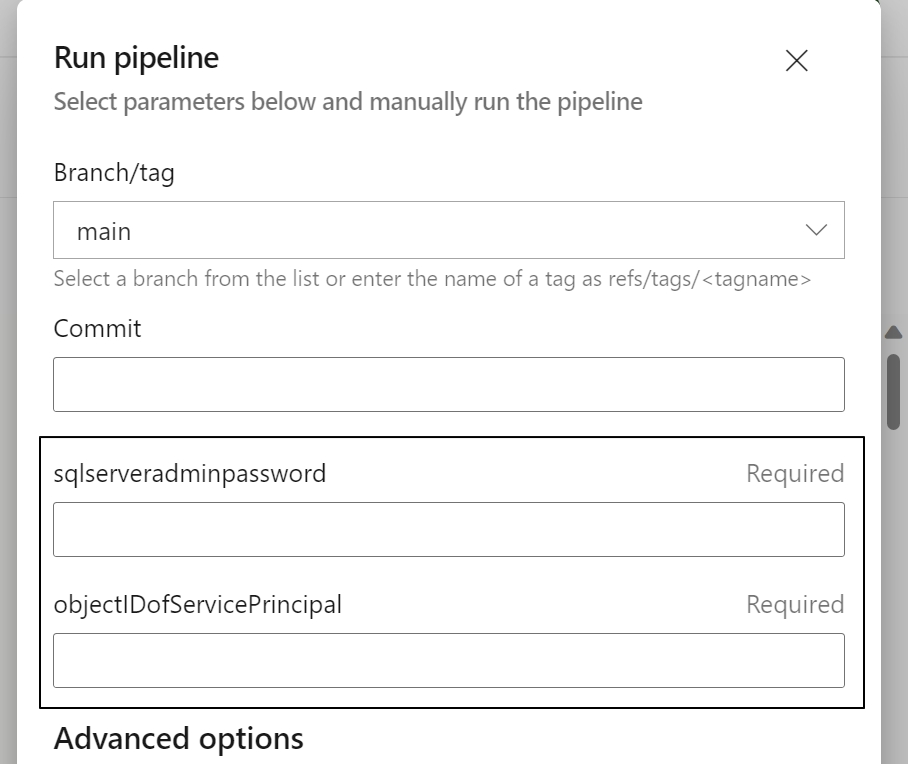
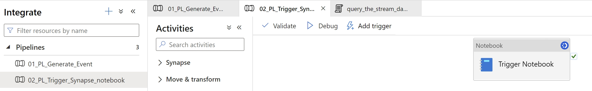
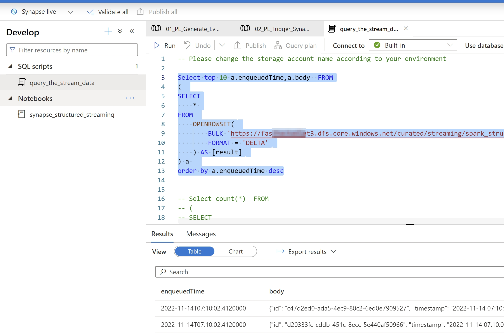

# Azure Synapse Data Lake Demo Environment ( Streaming )

## Prerequisites

* An active Azure subscription.
* An active DevOps account to use the Azure pipelines to deploy the resources.
* Service Principal has to be created and should be given Owner access over subscription, so that it can create new resource group and resources during the deployment. 
If "Owner" access can't be given, then assign it to a custom role which has access to the following:

  Microsoft.Authorization/roleAssignments/
* [create a Azure Resource Manager service connection](https://docs.microsoft.com/en-us/azure/devops/pipelines/library/service-endpoints?view=azure-devops&tabs=yaml#create-a-service-connection) from the Azure DevOps pipeline to connect the Azure subscription. 
* [create a github service connectoon](https://docs.microsoft.com/en-us/azure/devops/pipelines/library/service-endpoints?view=azure-devops&tabs=yaml#github-service-connection) to connect to the github repo.

## Architecture

## Azure Resources

Here are the Azure resources that are being deployed for the streaming pattern. 

1. **Azure function App** - Azure function App is going to generate dummy events. In the actual scenarios Azure function can be replaced with IoT hub or any kinf of event generator.
2. **Event Hub** - Azure Event Hubs is a big data streaming platform and event ingestion service. It can receive and process millions of events per second. In our case Event hub is receiving the data from the Azure function app.
3. **Azure Synapse Workspace** - We are using the following components from the Azure Synapse: 
   
   - *Azure Synapse spark Notebook*: We are using the spark structured streaing to process the stream data.
   - *Azure Synapse spark pool* : We are using the spark pool as the comute resource.
   - *Azure Synapse pipeline* : We are using the Azure Synapse pipeline as an orchestrator. 
   - *Azure Synapse On-Demand Ssql pool* : We are using this to query the delta table data on-demand basis.
  
  4.  **Azure Data Lake g2** - We are using the ADLS g2 as our data lake to persist the streaming data.
  5.  **Azure Key Vault** - We are using the Azure key vault to store the data.
  6.  **Azure Devops pipeline** - We are using the Azure Devops pipeline to deploy the artifacts.

## Deployment Steps

1. clone the repo: https://github.com/Azure/fta-Catalytics.git
2. change the configuration file: ./pattern2-streaming/config-infra-dev-streaming.yml

  - location: eastus 
  - prefix: fasthack 
  - postfix: pt3
  - environment: dev
  - ado_service_connection_rg: Azure-ARM-Dev-SAPA
  - gihub_repo_name: "Azure/fta-Catalytics"

3. Go to the Azure DevOps and map the yml file from the repo
   
4. Save and Run. It would be prompting for the SQL Server password and Object ID of the Service Principal. Provide the values. 
   
5.  Below stages are going to executed.  
     
6. Here are the resource that are going to get created post the deployment.

## Post Deployment
   1. Add your account as the synapse workspace admin. Otherwise, you will not be able to see the pipelines and the other components when you open the synapse workspace. Synapse workspace > Access Control -> add your logged in account as "Synapse Administrator"
   2. Also, add your account as "storage blob data contributor" for the datalake storage account. This would be required to interactivery query the data from the datalake in the Azure synapse notebook.
   3. Generate Event by running the below pipeline
   
  
  - Change the body section to change the number of events that you would like to generate. 
   {"number_of_events":80}
   - We can trigger the pipeline multiple times to generate multiple events.
   4.  In order to trigger the synapse streaming notebook, execute the below pipeline. 
   
   >> Please cancel the pipeline execution to stop the streaming notebook execution. Streaming notebook runs continiously.
   5. We can run the sql scripts to check the latest streaming data that are being saved in data lake. Please change the datalake name.
   
   

## Contributing

This project welcomes contributions and suggestions.  Most contributions require you to agree to a
Contributor License Agreement (CLA) declaring that you have the right to, and actually do, grant us
the rights to use your contribution. For details, visit https://cla.opensource.microsoft.com.

When you submit a pull request, a CLA bot will automatically determine whether you need to provide
a CLA and decorate the PR appropriately (e.g., status check, comment). Simply follow the instructions
provided by the bot. You will only need to do this once across all repos using our CLA.

This project has adopted the [Microsoft Open Source Code of Conduct](https://opensource.microsoft.com/codeofconduct/).
For more information see the [Code of Conduct FAQ](https://opensource.microsoft.com/codeofconduct/faq/) or
contact [opencode@microsoft.com](mailto:opencode@microsoft.com) with any additional questions or comments.

## Trademarks

This project may contain trademarks or logos for projects, products, or services. Authorized use of Microsoft 
trademarks or logos is subject to and must follow 
[Microsoft's Trademark & Brand Guidelines](https://www.microsoft.com/en-us/legal/intellectualproperty/trademarks/usage/general).
Use of Microsoft trademarks or logos in modified versions of this project must not cause confusion or imply Microsoft sponsorship.
Any use of third-party trademarks or logos are subject to those third-party's policies.
