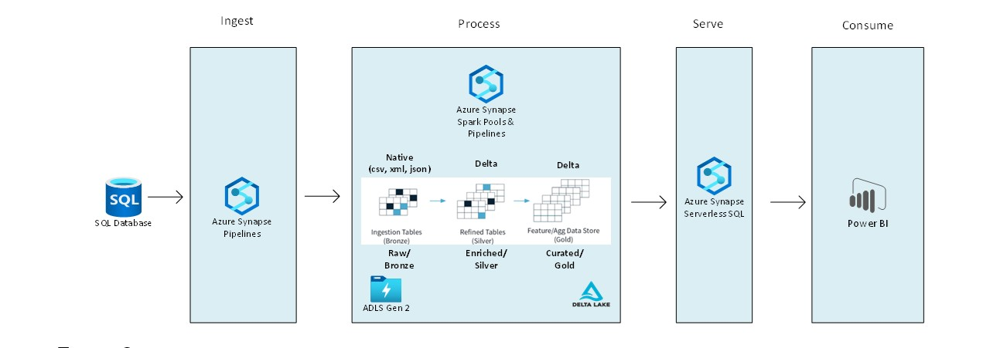
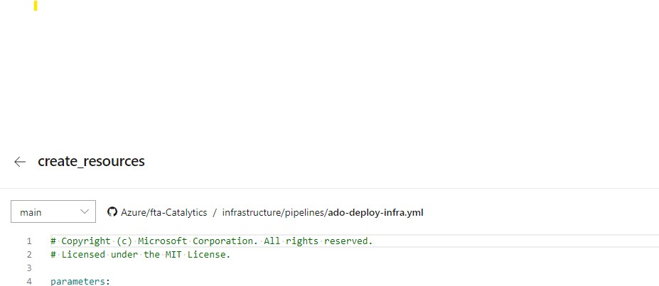

# Pattern 4: Azure Synapse Data Lake Demo Environment (Batch)

## Prerequisites
* An active Azure subscription.
* An active Azure DevOps account.
* Service Principal has to be created and should be given Owner access over subscription, so that it can create new resource group and resources during the deployment. 
If "Owner" access can't be given, then assign it to a custom role which has access to the following:   Microsoft.Authorization/roleAssignments/
* [Create an Azure Resource Manager service connection](https://docs.microsoft.com/en-us/azure/devops/pipelines/library/service-endpoints?view=azure-devops&tabs=yaml#create-a-service-connection) from the Azure DevOps pipeline to connect the Azure subscription. 
* [Create a github service connection](https://docs.microsoft.com/en-us/azure/devops/pipelines/library/service-endpoints?view=azure-devops&tabs=yaml#github-service-connection) to connect to the github repo.

## Architecture
Below is a high-level diagram of the solution.

## Resource Diagram
Here are the Azure resources that are going to be deployed using the devops pipeline. 

## Deployment Steps
### Fork repository and update configuration file

1. Fork the repo: https://github.com/Azure/AnalyticsinaBox/tree/main/src/bicep-deployment/Pattern4/infrastructure to your git repo
1. Change the configuration file: .\src\bicep-deployment\Pattern 4\config-infra-dev.yml

Update the below parameters (examples provided):  
location: eastus  
prefix: P3Analytics  
postfix: uc1  
environment: dev  
objectID: '<< object ID of the service principal >>'  
ado_service_connection_rg: Azure-ARM-Dev-SAPA  

### Deploy to Azure DevOps
1. If not already done, create a new Project in Azure DevOps.
1. Install the Synapse Deployment Task into your ADO Project from here: https://marketplace.visualstudio.com/items?itemName=AzureSynapseWorkspace.synapsecicd-deploy
1. Create an environment named 'dev'.
1. Go to the Azure DevOps and map the yml file from the repo (If you are using the workspace_publish branch, uncomment from line 23 to line 29 in ado-deploy-infra.yml pipeline. If you are cloning the repo as is, then leave this value blank)
   
1. Save and Run. 
1. You will receive a prompt for the below parameters:
    1. SQL Server password (please be aware of advanced complexity requirements)
    1. objectIDofServicePrincipal
1. Four stages are going to executed.  
     
1. On your first execution, the pipeline may pause at step 3 requesting permission to the 'dev' environment.
1. Here are the resource that are going to get created post the deployment.

## Post Deployment
1. Add your account as the Synapse workspace administrator. Otherwise, you will not be able to see the pipelines and the other components when you open the Synapse workspace.   Synapse workspace > Access Control -> add your logged in account as "Synapse Administrator"
2. Run the master pipeline from the Azure Synapse pipeline. Provide the required parameter Date to current date "YYYY-MM-DD" format.
   
## Contributing
This project welcomes contributions and suggestions.  Most contributions require you to agree to a
Contributor License Agreement (CLA) declaring that you have the right to, and actually do, grant us
the rights to use your contribution. For details, visit https://cla.opensource.microsoft.com.

When you submit a pull request, a CLA bot will automatically determine whether you need to provide
a CLA and decorate the PR appropriately (e.g., status check, comment). Simply follow the instructions
provided by the bot. You will only need to do this once across all repos using our CLA.

This project has adopted the [Microsoft Open Source Code of Conduct](https://opensource.microsoft.com/codeofconduct/).
For more information see the [Code of Conduct FAQ](https://opensource.microsoft.com/codeofconduct/faq/) or
contact [opencode@microsoft.com](mailto:opencode@microsoft.com) with any additional questions or comments.

## Trademarks

This project may contain trademarks or logos for projects, products, or services. Authorized use of Microsoft 
trademarks or logos is subject to and must follow 
[Microsoft's Trademark & Brand Guidelines](https://www.microsoft.com/en-us/legal/intellectualproperty/trademarks/usage/general).
Use of Microsoft trademarks or logos in modified versions of this project must not cause confusion or imply Microsoft sponsorship.
Any use of third-party trademarks or logos are subject to those third-party's policies.
